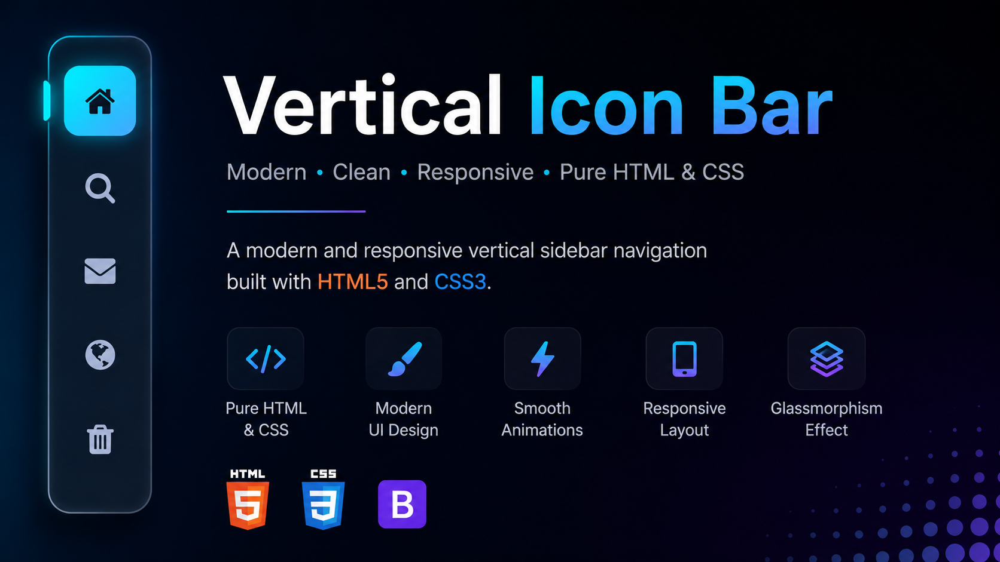

# 🚀 Modern Vertical Icon Bar

A clean and modern **Vertical Icon Bar (Sidebar Navigation)** built using **HTML5** and **CSS3**. This project features a glassmorphism-inspired UI with smooth hover animations, an active menu indicator, and Font Awesome icons.

## ✨ Features

- 🎨 Modern Glassmorphism Design
- 📱 Responsive Layout
- ⚡ Smooth Hover Animations
- 🌈 Active Navigation Indicator
- 🧩 Font Awesome Icons
- 💻 Beginner Friendly Code
- 🚀 Pure HTML & CSS (No JavaScript)

## 🛠️ Technologies Used

- HTML5
- CSS3
- Font Awesome

## 📂 Project Structure

```
├── index.html
├── style.css
└── README.md
```

## 📸 Preview


```

## 🚀 Getting Started

1. Clone the repository

```bash
git clone https://github.com/TineshChasiya/Vertical-Icon-Bar.git
```

2. Open the project folder.

3. Run `index.html` in your browser.

## 📚 What You'll Learn

- Flexbox Layout
- Vertical Navigation Design
- Glassmorphism UI
- CSS Hover Effects
- CSS Transitions
- Modern Sidebar Styling
- Font Awesome Integration

## 💡 Customization

You can easily customize:

- Colors
- Icons
- Hover Effects
- Active Menu
- Border Radius
- Width
- Background
- Shadows
- Animations

## 🤝 Contributing

Contributions are welcome!

1. Fork the repository
2. Create a new branch
3. Make your changes
4. Commit your changes
5. Submit a Pull Request

## ⭐ Support

If you found this project helpful, please consider giving it a ⭐ on GitHub.

## 📬 Connect With Me

- GitHub: https://github.com/TineshChasiya/
- LinkedIn: https://www.linkedin.com/in/tinesh-chasiya-a52289271/

---

Made with ❤️ using HTML & CSS.